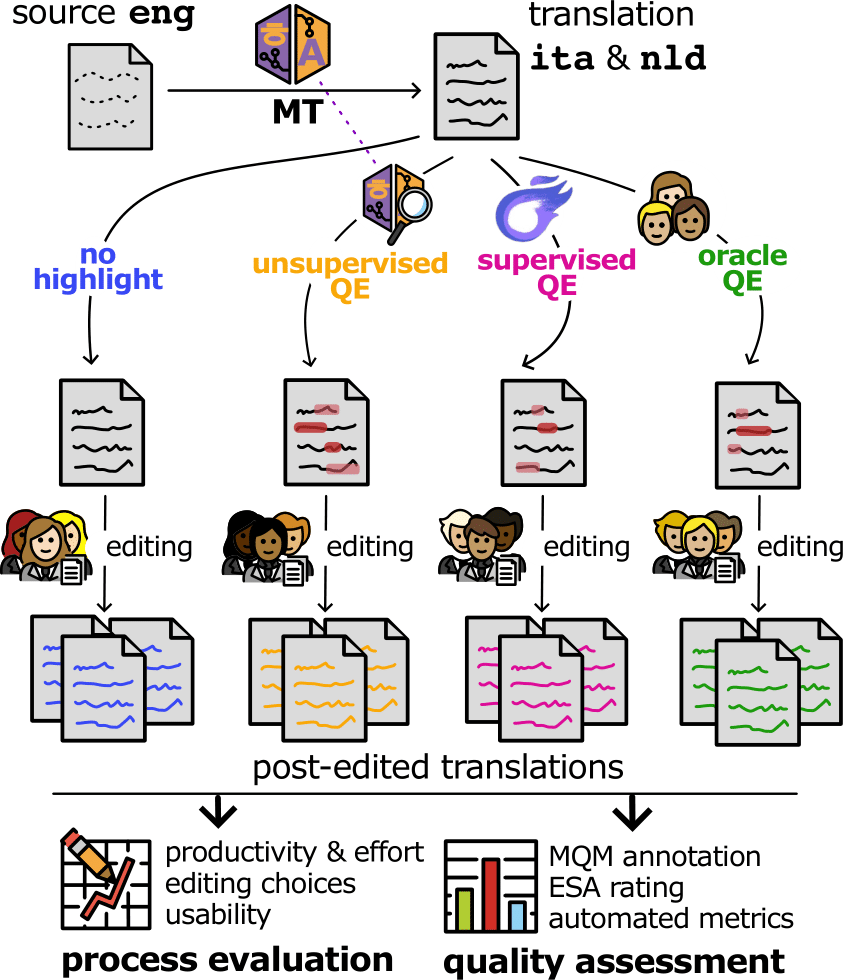
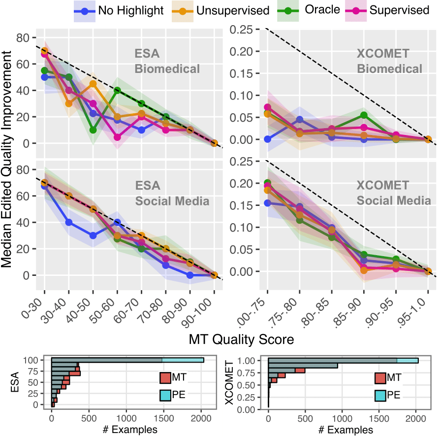

# QE4PE: Word-level Quality Estimation for Human Post-Editing

[Gabriele Sarti](https://gsarti.com) • [Vilém Zouhar](https://vilda.net/) •  [Grzegorz Chrupała](https://grzegorz.chrupala.me/) • [Ana Guerberof Arenas](https://scholar.google.com/citations?user=i6bqaTsAAAAJ) • [Malvina Nissim](https://malvinanissim.github.io/) • [Arianna Bisazza](https://www.cs.rug.nl/~bisazza/)

<p float="left">
    
    
</p>

> **Abstract:** Word-level quality estimation (QE) detects erroneous spans in machine translations, which can direct and facilitate human post-editing. While the accuracy of word-level QE systems has been assessed extensively, their usability and downstream influence on the speed, quality and editing choices of human post-editing remain understudied. Our QE4PE study investigates the impact of word-level QE on machine translation (MT) post-editing in a realistic setting involving 42 professional post-editors across two translation directions. We compare four error-span highlight modalities, including supervised and uncertainty-based word-level QE methods, for identifying potential errors in the outputs of a state-of-the-art neural MT model. Post-editing effort and productivity are estimated by behavioral logs, while quality improvements are assessed by word- and segment-level human annotation. We find that domain, language and editors' speed are critical factors in determining highlights' effectiveness, with modest differences between human-made and automated QE highlights underlining a gap between accuracy and usability in professional workflows.

This repository contains data, scripts and notebooks associated to the paper ["QE4PE: Word-level Quality Estimation for Human Post-Editing"](TODO). If you use any of the following contents for your work, we kindly ask you to cite our paper:

```bibtex
@article{sarti-etal-2024-qe4pe,
    title = "{QE4PE}: Word-level Quality Estimation for Human Post-Editing",
    author = "Sarti, Gabriele and Zouhar, Vil{\'e}m and Chrupa{\l}a, Grzegorz and Nissim, Malvina and Bisazza, Arianna",
    journal = "Arxiv preprint",
    month = mar,
    year = "2024",
    url = "TODO",
}
```

## 🐮 Groningen Translation Environment (GroTE)

GroTE is a simple Gradio-based interface for post-editing machine translation outputs with error spans. It allows to visualize and edit translations in a web interface hosted on [HF Spaces](https://huggingface.co/spaces), with real-time logging of granular editing actions. Find out more about setting up and running GroTE in the [GroTE repository](https://github.com/gsarti/grote).

## The QE4PE Dataset

Processed QE4PE logs for `pre`, `main` and `post` tags, MQM/ESA annotations and questionnaire responses are available as [🤗 Datasets](https://huggingface.co/datasets/gsarti/qe4pe). Summary of the data:

- Post-edits over [NLLB 3.3B](https://huggingface.co/facebook/nllb-200-3.3B) outputs for >400 segments from [WMT23](https://www2.statmt.org/wmt23/) (social media and biomedical abstracts): **15 edits per direction** (3 oracle post-edits + 12 core set translators) for En->It and En->Nl.
- A single set of [MQM](https://themqm.org/) and [ESA](https://aclanthology.org/2024.wmt-1.131/) annotations from 12 human annotators for **MT outputs and all post-edited versions** across both directions for a subset of ~150 segments.
- Fine-grained editing logs for core set translators across `pre`, `main` and `post` editing phases.
- Pre- and post-task questionnaires for all post-editors.

The raw logfiles produced by our [🐮 GroTE](https://github.com/gsarti/grote) interface are available in the `task` folder in the same repository as the datasets. Refer to the [main QE4PE dataset readme](https://huggingface.co/datasets/gsarti/qe4pe) and readmes in each task folder for more details about the provided data.

## Reproducing Our Processing Pipeline

This section provides a step-by-step guide to reproduce the data processing and analysis steps for the QE4PE study.

**IMPORTANT:** While we describe how to regenerate all outputs we used for our analysis, they are all pre-computed and available in the [🤗 Datasets](https://huggingface.co/datasets/gsarti/qe4pe) repository.

### 1. Setup

Install the required dependencies and the `qe4pe` package:

```bash
pip install -r requirements-dev.txt
pip install -e .
```

Download the QE4PE repository from the [🤗 Datasets](https://huggingface.co/datasets/gsarti/qe4pe) repository and place it in the `data` folder (it can be pulled as a git submodule with `git submodule update --init --recursive` and `git submodule update --recursive`).

### 2. Generate WMT23 Outputs

TODO: Add script for generation with NLLB 3.3B

The generated outputs are saved in `data/setup/wmt23/nllb_<SIZE>/wmttest2023.<LANG>`, with `<SIZE>` being either `3b` or `600m` and `<LANG>` being `ita` or `nld`.

### 3. Annotate Outputs with XCOMET

TODO: Add script for XCOMET annotations

The generated outputs are saved in `data/setup/wmt23/nllb_<NLLB_SIZE>/wmttest2023_xcomet-<XCOMET_SIZE>_<LANG>.json`, with `<NLLB_SIZE>` being either `3b` or `600m`, `<LANG>` being `ita` or `nld`, and `<XCOMET_SIZE>` being `xl` or `xxl`.

### 4. From WMT23 Outputs to Selected Segments

Run `qe4pe filter-wmt-data` to recover selected segments for `pre`, `main` and `post` editing phases from the full set of WMT23 segments and their translations available in `data/setup/wmt23`. Intermediate outputs are saved in `data/setup/processed`.

### 5. Generate Highlights for Selected Segments

TODO: Add scripts for generating highlights with XCOMET and the unsupervised methods.

Highlighted segments are saved in the `data/setup/highlights` folder.

### 6. Generate QA Dataframe from HTML MQM/ESA Annotations

Raw QA annotations are provided in `data/setup/qa/eng-ita` and `data/setup/qa/eng-nld`.

TODO: Add script for converting HTML annotations to a QA dataframe.

The final dataframe is saved in `data/setup/qa/qa_df.csv`.

### 7. Putting it All Together: Merging Outputs, Logs and QA into a Unified Dataset

Run `qe4pe process-task-data --TASK_PATH` to perform the preprocessing of outputs and logs for a specific task in `data/setup/task`, e.g. `qe4pe process-task-data data/task/main`. The processing is controlled by the task `processing_config.json` file, which specifies paths and additional info (e.g. for `main` QA annotations are merged with other fields).

The processed data is saved in `data/processed/task` as `processed_<TASK>.csv`.

## Reproducing Our Analysis

### 1. Visualizing the Selection Process

TODO: Add notebook with plots from the selection process.

### 2. Reproducing the Paper Analysis from Processed Data

Follow the [analysis notebook](notebooks/analysis.ipynb) to reproduce the main plots and results from the paper. While some plots were retouched in Inkscape for the final version (marked as `_edited` in `figures/`), we provide the code to generate them from the processed data.

Modeling results can be reproduced from the [modeling notebook](notebooks/modeling.Rmd).

TODO: Add additional analysis scripts for appendix plots.

## See an Issue?

If you encounter any issues while running the scripts or notebooks, please open an issue in this repository. We will be happy to help you out!
